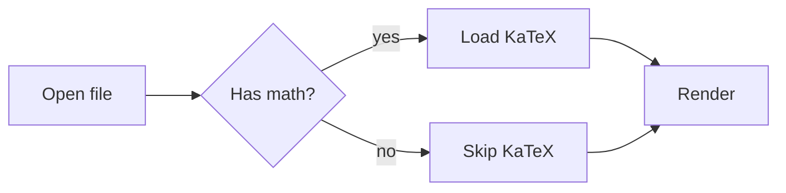
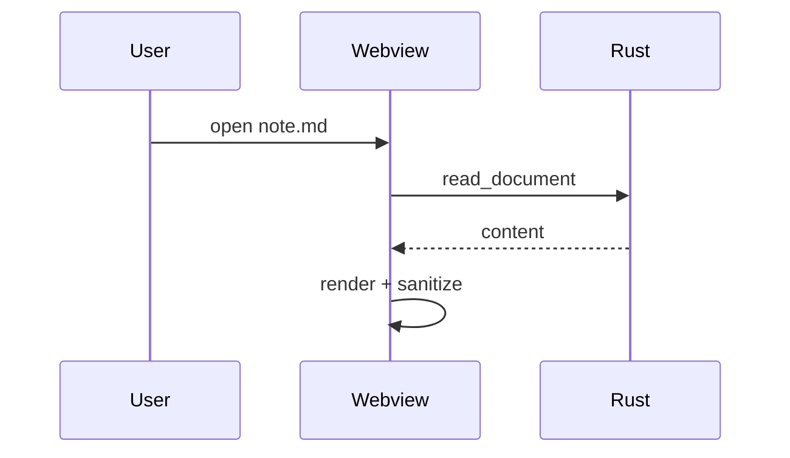

# MDX feature showcase

Every construct MDX understands, on one page. Use it to check a rendering
change, or as a reference for what syntax is available.

[[Missing Note]] links and `mdx --help` both work from here.

## Text

*Emphasis*, **strong**, ***both***, ~~struck through~~, `inline code`,
++inserted++, ==highlighted==, H~2~O, x^2^, and an ~~~unknown~~~ sequence that
is left alone.

Abbreviations expand on hover: the HTML spec and the W3C say so.

*[HTML]: HyperText Markup Language
*[W3C]: World Wide Web Consortium

Emoji shortcodes: :rocket: :books: :warning: :white_check_mark:

Typographic replacements: "quotes" become curly, -- becomes an en dash,
--- an em dash, and ... an ellipsis.

Line one of a hard break.
Line two follows after two trailing spaces.

## Lists

1. Ordered item
2. Second item
   1. Nested ordered
   2. Another
3. Third

- Unordered item
- With a nested list
  - Deeper
    - Deeper still

- [x] Completed task
- [ ] Pending task
- [x] Task with `code` and a [link](https://example.org)

Term
: Definition of the term.

Another term
: First definition.
: Second definition.

## Quotes and callouts

> A plain block quote.
>
> > Nested one level deeper.

> [!NOTE]
> GitHub-flavoured alert syntax is supported.

> [!TIP]
> So are tips.

> [!IMPORTANT]
> And notices that matter.

> [!WARNING]
> And warnings.

> [!CAUTION]
> And cautions.

::: info Container syntax
The `:::` spelling used by MkDocs, Docusaurus and VitePress works too.
:::

::: warning - Collapsed by default
A leading `-` makes the block start closed.
:::

::: details Extra detail
A plain collapsible section.
:::

## Code

```python title="fib.py" {2,4-5}
def fib(n: int) -> int:
    if n < 2:
        return n
    a, b = 0, 1
    for _ in range(n - 1):
        a, b = b, a + b
    return b
```

```rust
fn main() {
    println!("Hello from Rust");
}
```

```
A fence with no language falls back to automatic detection.
```

    An indented code block gets the same treatment.

## Tables

| Language | Typing   | Year |
| -------- | -------- | ---: |
| Rust     | static   | 2010 |
| Python   | dynamic  | 1991 |
| TypeScript | static | 2012 |

| Spanning |||
| :------- | :------: | -------: |
| left     | centre   | right    |
| a        | b        | c        |

## Math

Inline: the identity $e^{i\pi} + 1 = 0$ sits in a sentence, and a price like
$20 is left alone.

Display:

$$
\int_{-\infty}^{\infty} e^{-x^2}\,dx = \sqrt{\pi}
$$

$$
\begin{pmatrix} a & b \\ c & d \end{pmatrix}
\begin{pmatrix} x \\ y \end{pmatrix}
=
\begin{pmatrix} ax + by \\ cx + dy \end{pmatrix}
$$

## Diagrams





## Footnotes

Markdown-it handles footnotes[^1] including named ones[^note].

[^1]: The first footnote.
[^note]: A named footnote with `code` inside.

## Links and media

- External: [example.org](https://example.org)
- Anchor: [jump to Text](#text)
- Autolinked: https://example.org
- Wiki link: [[kitchen-sink]]


## Attributes

A heading or paragraph can carry attributes. {.lead}

### Custom id {#custom-anchor}

## HTML passthrough

<div align="center">
  Raw HTML is rendered, but <strong>sanitised</strong> first.
</div>

<script>alert("this never runs")</script>


---

That horizontal rule ends the tour.
